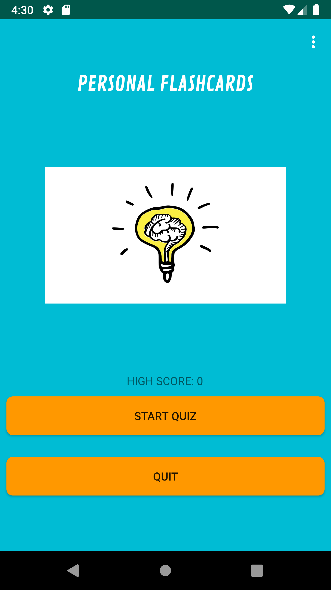
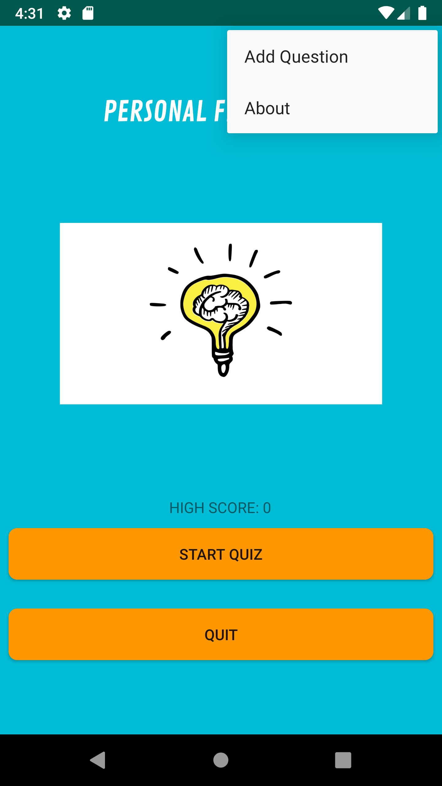
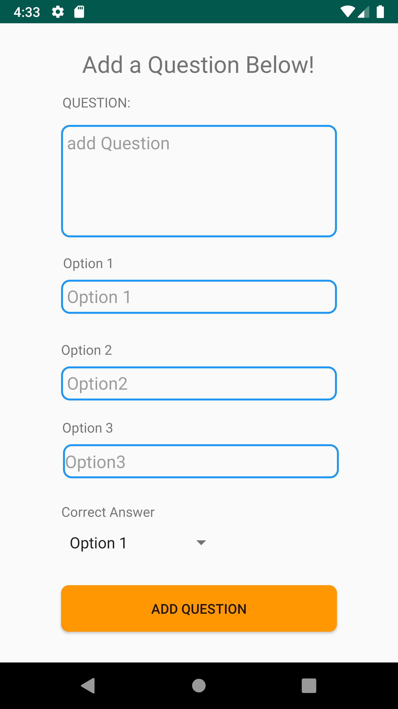
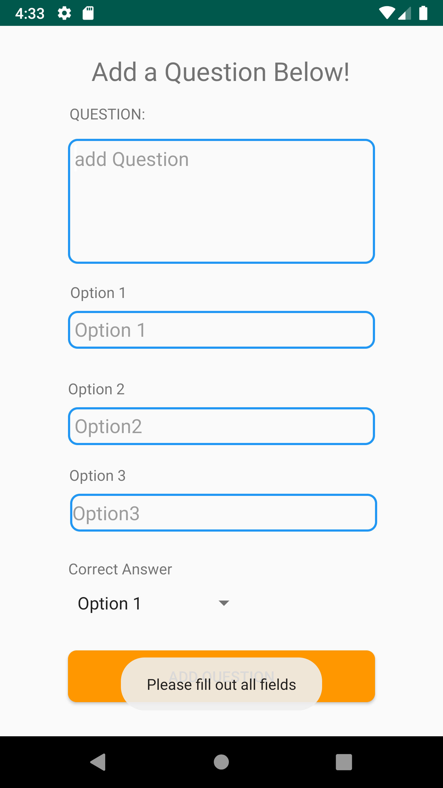
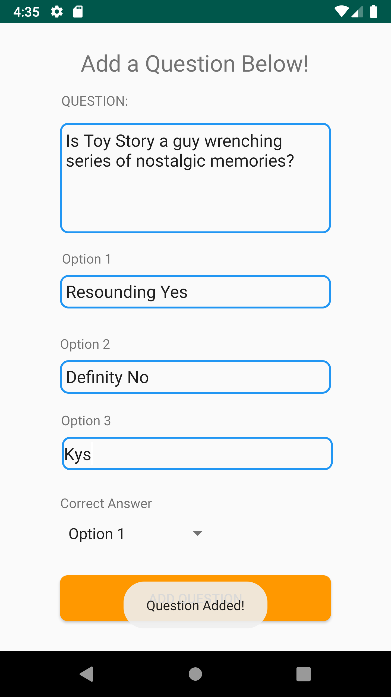
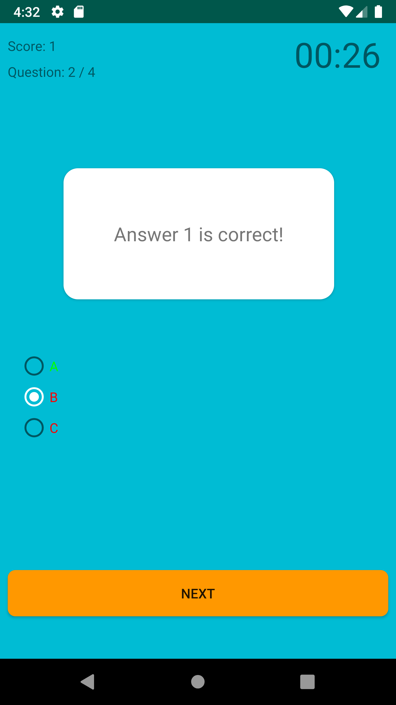
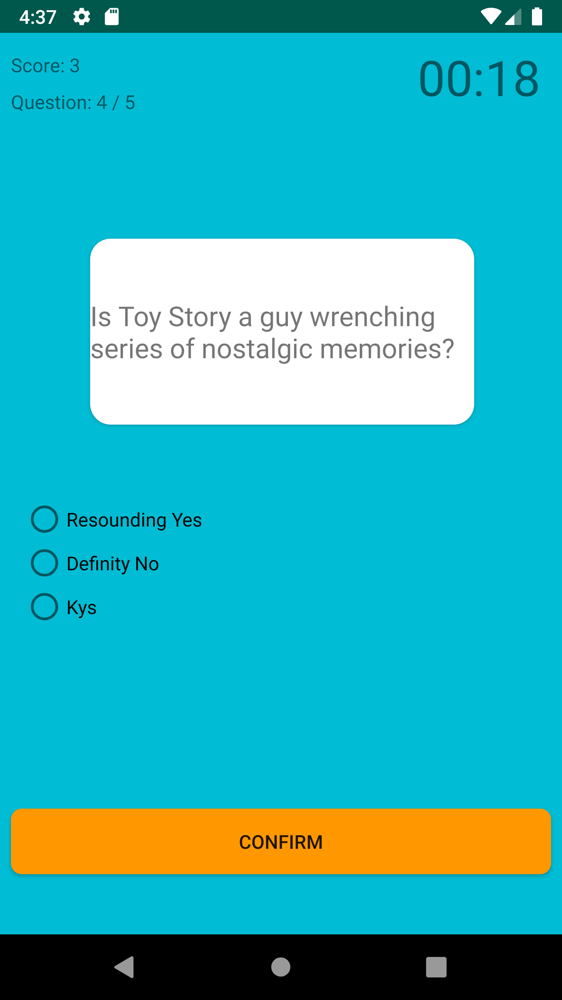
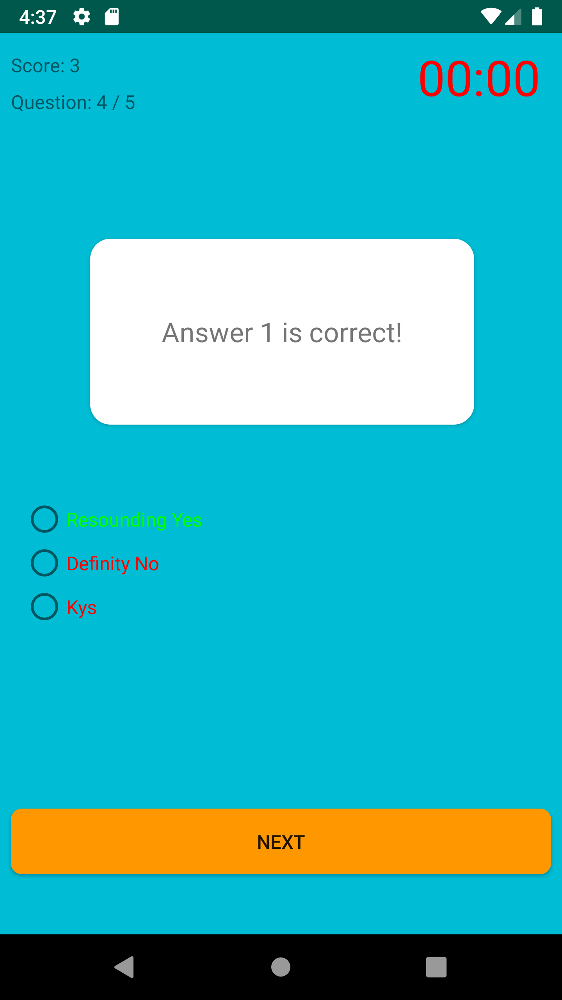

# Flash Card Application

This is a little side project I set myself over the past week and a half to learn more about Android Development and SQLite.

## Features 
1. Localized Sqlite database, so questions are saved for use.
2. Add your own personal questions.
3. 30 Second timer for each question attempt
4. High Score counter
5. Question counter 

## Screenshots
|

|
|

|
|

